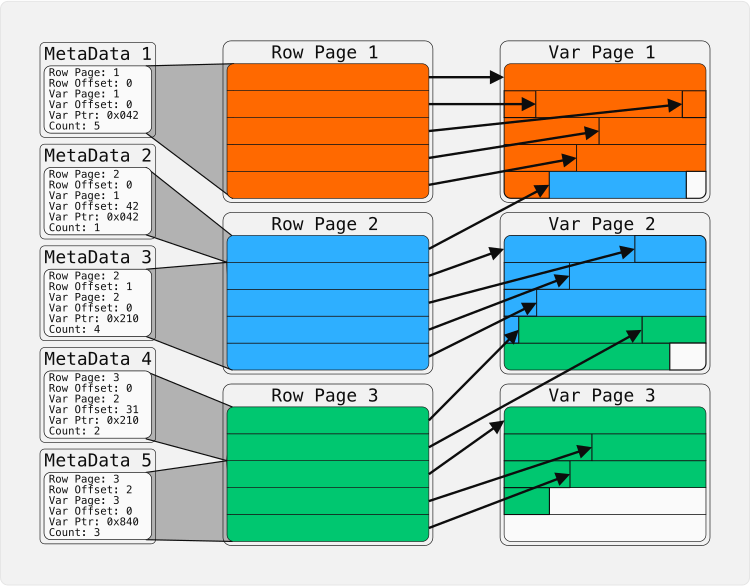
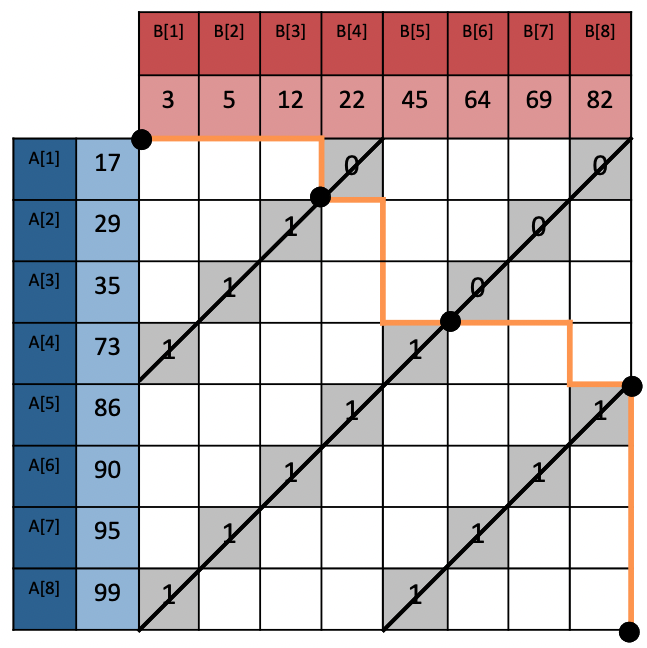
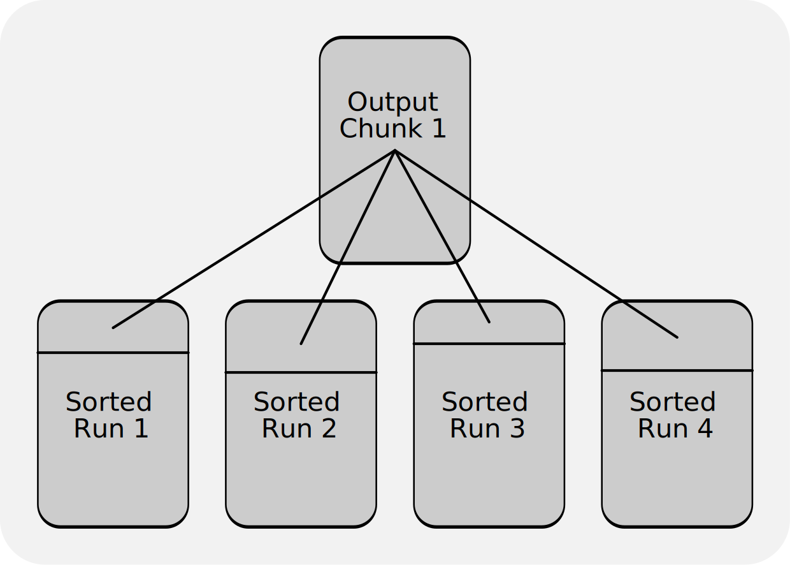

### DuckDB 的排序算法

#### 概览
在最新发布的 DuckDB v1.4.0 中，作者时隔 4 年再次重新实现了排序算法。在更早的更新中，作者使用了[新的内存页布局 (page layout)](https://duckdb.org/2024/03/29/external-aggregation.html) 并成功应用于 [hash join](https://github.com/duckdb/duckdb/pull/4189) 和 [hash aggregation](https://github.com/duckdb/duckdb/pull/7931) 等算子，以提高内存不足场景下的查询效率。为了**适配新的内存页布局**，作者重新实现了排序算法。

新的排序算法有以下几个优势：
- 显著提升**有序数据**的排序效率（排序时间减少到原来的$\frac{1}{10}$），**随机数据**的排序时间减少到原来的$\frac{1}{2}$。
- 针对内存无法容纳的大表查询，**减少了I/O和数据的移动**，使得整体排序时间减少到原来的$\frac{1}{3} \sim \frac{1}{2}$。
- 算法的**多线程并行性**提高：尽管在单线程的场景下性能略微下降，但随着线程数目增多，排序效率获得大幅提升, 并逐渐超过之前版本。
- 增加实现了 SQL 的 ``create_sort_key`` 函数。 

算法的基本框架仍然基于归并排序，具体实现的主要变化如下：
- DuckDB 使用固定大小的排序键。在过去版本中，其大小在执行**查询时**才会被计算。当前版本使用了**新的排序键存储结构**，在**编译时**就可以知道其大小。
- 通过实现 ``std::iterator`` ，允许有序块 (sorted runs) **使用非连续内存**（多个 pages）。这样不仅可以产生**更大的有序块**（用于提高后续步骤的效率），还可以直接调用 C++ 自带的排序算法。 
- 有序块的排序**组合使用3种排序算法**（之前仅用基数排序）：先用[Vergesort](https://github.com/Morwenn/vergesort) 检测数据是否几乎有序，再用 [Ska Sort](https://github.com/skarupke/ska_sort) （基数排序的变种）将数据按排序键最高 64 位排序/分类，最后再使用快速排序 [Pattern-defeating quicksort](https://github.com/orlp/pdqsort)。 
- 有序块的合并从之前的 **2-way merge** 改为使用 **k-way merge**；将之前的 merge path 推广到 **k-way merge path**。在之前的版本中，算法会完全计算出整个排序后的序列；新算法会逐渐计算排序结果的前缀并可以随时终止，这有利于``ORDER BY ... LIMIT ...``类型的查询。


#### 新的内存页布局 (page layout)
(这一段文章里没写，我参考了[以前的文章](https://duckdb.org/2024/03/29/external-aggregation.html)。 但只介绍了新的page layout是怎样的，没有介绍之前的版本是怎样的)

DuckDB的内存页布局中，每一行可能会存储指向不定长数据（比如字符串）的内存指针。但是当指针指向的数据被写入磁盘后，指向的地址不再有意义，即使数据可能会被重新载入内存，但在内存中的地址也会发生变化。

在过去的版本中，如果数据被写入磁盘，会导致大量内存指针的重计算。新版本采用如下图所示的内存页布局。

<p align="center"></p>


Row Page 会存储额外的 MetaData，用以记录存储实际数据的 Var Page 的地址信息。当对应的 Var Page 被写入磁盘时，指针失效。但当它再次被载入内存的时候，可以快速地通过 MetaData 计算出新的指针地址。该方式的优势是用lazy的方式更新指针（可以通过 MetaData 检查指针是否已失效），减少了指针的重计算，

#### 内存里排序得到有序块 (sorted runs)

##### 排序算法
新的排序实现**组合使用了3种排序算法**（之前仅用基数排序）。

- [Vergesort](https://github.com/Morwenn/vergesort) 用于检测和合并数据的有序段。当数据几乎有序时（比如时序数据），表现比较好。
- 如果 Vergesort 没有检测到数据的有序性，转为使用 [Ska Sort](https://github.com/skarupke/ska_sort) （基数排序的变种）将数据按排序键最高 64 位排序/分类。
- 当上面的 Ska Sort 将数据根据最高 64 位 划分后，如果数据仍然无序或者当前划分数据规模已经较小，使用快速排序 [Pattern-defeating quicksort](https://github.com/orlp/pdqsort)。 

##### 具体实现细节

DuckDB 使用**大小固定的排序键**。在最新的版本中，作者使用如下结构体``struct``来保存整合后的键值（**Normalized Key**： 即将多个关键字压缩成128位01串， 比较时可以利用``memcpy``。 如果128位不够，额外保存数据指针 ``payload``）。

```cpp
struct FixedSortKeyNoPayload {
    uint64_t part0;
    uint64_t part1;
};

struct FixedSortKeyPayload {
    uint64_t part0;
    uint64_t part1;
    data_ptr_t payload;
};
```
在之前的版本中，每个有序块单独存放在一个页 (page) 中。现在作者希望使用**更大的有序块**，于是通过实现 ``std::iterator`` ，允许有序块 (sorted run) **使用非连续内存**（多个 pages）。因为键值大小恒定，每个页存储的键数量也相同，因此可以用整除和模运算计算出某条键存储在哪一页哪一行（作者使用了[fastmod](https://github.com/lemire/fastmod))。

通过``std::iterator``，可以把多个页的数据看做一个连续数组（支持随机访问），这使得排序的时候可以直接调用 C++ 库自带的排序算法。


#### 合并有序块

##### 之前版本的2路归并 ([cascade 2-way merge sort](https://duckdb.org/2021/08/27/external-sorting.html))

动机： 当有序块的个数较多的时候，多个线程可以并行进行合并;但是当有序块个数少于线程数的时候，想办法让多个线程一起参与两个有序块的合并。为此作者复现了[Merge Path](https://arxiv.org/pdf/1406.2628.pdf)。

算法的思想如下图所示。考虑合并两个有序数组A和B, 橙色的折线反映了合并的过程：横线表示元素来自B数组，竖线表示元素来自A数组。可以根据线程数量将橙色折线分成若干均匀段，每一段对应一个独立的合并任务。橙色折线的拐点可以很容易用二分搜索计算出来。


<div style="text-align:center;">  </div>


##### 新版本的k路归并 

新版本将之前的多线程2路归并推广到k路 （之前产生更长的 sorted runs 对k路归并更友好）。
如下图所示，如果有多个有序块，我们要输出合并后的前$\ell$个数，同样可以用二分搜索找出第$i$个块的前$q_i$个属于输出的前$\ell$个。这一部分可以分给一个线程来合并，然后继续计算输出的下$\ell$个数，分别对应每个块的哪一段，交给另一个线程来合并。以此类推，我们可以把合并$k$个有序块的任务多线程并行化。
<div style="text-align:center;">
    
</div>


#### 实验结果

测试环境： M1 Max MacBook Pro, 10 线程 64 GB 内存

作者先测试了对单列整数的排序，分别考虑了递增、递减、随机数据以及10m, 100m, 1000m 的数据规模。结果如下：

<div style="text-align: center;">

| Table      | Rows [Millions] | Old [s]  | New [s]   | Speedup vs. Old [x] |
|:---------: |:--------------: |:-------: |:--------: |:------------------: |
| Ascending  | 10              | 0.110    | **0.033** | 3.333               |
| Ascending  | 100             | 0.912    | **0.181** | 5.038               |
| Ascending  | 1000            | 15.302   | **1.475** | 10.374              |
| Descending | 10              | 0.121    | **0.034** | 3.558               |
| Descending | 100             | 0.908    | **0.207** | 4.386               |
| Descending | 1000            | 15.789   | **1.712** | 9.222               |
| Random     | 10              | 0.120    | **0.094** | 1.276               |
| Random     | 100             | 1.028    | **0.587** | 1.751               |
| Random     | 1000            | 17.554   | **6.493** | 2.703               |

</div>


可以看到，新的排序算法实现对于有序数据排序效率快了近10倍，对随机数据快了近2倍。


接下来，作者对一个有15列的宽表按某一列进行排序，分别取 6m, 60m, 600m 行。当数据规模达到 600m 的时候，数据无法完全存储于内存。

<div style="text-align: center;">

| Table                                   | SF  | Old [s]  | New [s]   | Speedup vs. Old [x] |
|:--------------------------------------: |:--: |:-------: |:--------: |:------------------: |
| TPC-H SF 1 lineitem by l_shipdate       | 1   | 0.328    | **0.189** | 1.735               |
| TPC-H SF 10 lineitem by l_shipdate      | 10  | 3.353    | **1.520** | 2.205               |
| TPC-H SF 100 lineitem by l_shipdate     | 100 | 273.982  | **80.919** | 3.385               |

</div>
